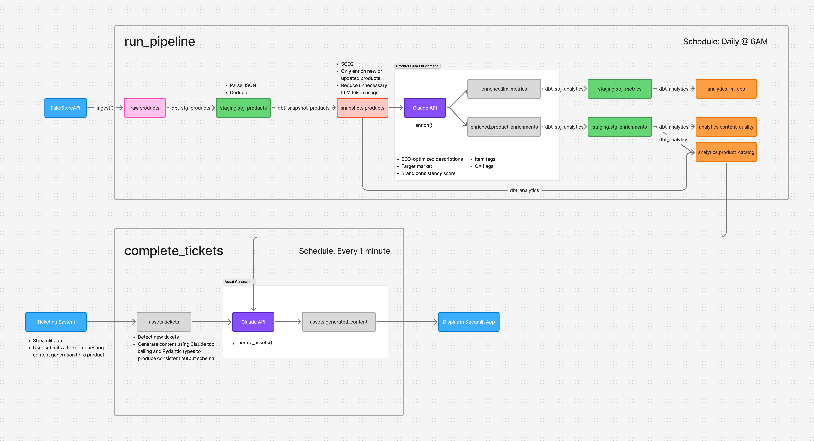

# Content Intelligence Pipeline

## Description
An end-to-end data pipeline that ingests product catalog data, enriches it via LLM-powers content analysis, and executes downstream marketing tasks from a ticket queue to simulate the workflow of an enterprise content platform, transforming raw product data into publish-ready assets.

The pipeline ingests product listings from the FakeStore API into PostgreSQL, uses the Anthropic API to enrich each product with SEO-optimized descriptions, brand consistency scoring, auto-generated tags, and QA flags. The data is transformed via a layered dbt model architecture (raw -> staging -> snapshots -> enriched -> analytics). A separate ticket execution system picks up pending content generation tasks (landing pages, email campaigns, meta tags, alt text, brand reviews) and generates the requested assets using the enriched product data. SCD2 is implemented via dbt snapshots to track product changes in the source over time and prevent unnecessary LLM re-processing to reduce API cost. A Streamlit UI is used for ticket submission, asset previews, and LLM operational monitoring.

Stack: Python, PostgreSQL, dbt, Apache Airflow, Docker, Claude API, Streamlit

## Instructions

### 1. Clone the repo
### 2. Copy .env.example to .env and fill in values (ANTHROPIC_API_KEY)
### 3. Build images (docker compose --profile transform build)
### 4. Start services (docker compose up)
### 5. Open Airflow at http://localhost:8000 (user = "admin" & password shown in logs)
### 6. Open Streamlit at http://localhost:8501
### 7. Run the "run_pipeline" DAG and enable the "complete_tickets" DAG in Airflow
### 8. Submit asset generation requests on the "Submit Ticket" tab of the Streamlit application

## Architecture
